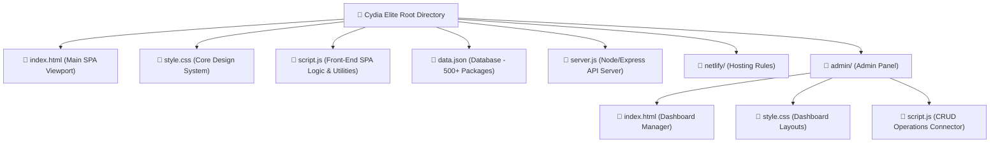

# Cydia Elite OS v4.0 — Product Summary

Cydia Elite OS v4.0 is a premium, spatial web application and developer registry designed by UI/UX Engineer and Developer **Chya Luqman**. Inspired by the nostalgic and clean look of iOS package managers (like Cydia/Sileo), the portal blends a highly interactive developer portfolio with a fully-featured utility marketplace, media streaming system, search automation tools, and a dynamic developer API hub.

---

## 🌌 1. Core Vision & Design Aesthetics

Cydia Elite is engineered to offer an immersive, high-fidelity user experience built around modern web aesthetics and iOS-inspired designs:
* **Spatial Canvas Design**: Responsive, neon-accented glassmorphic layouts, dynamic orbits, glowing backgrounds, and web scanning elements that adapt to desktop and mobile displays.
* **Biometric Lock Experience**: A simulated iOS "Respring" boot sequence with rolling console logs, followed by an elegant **Face ID biometric scanning simulation** that authenticates users before granting portal access.
* **Interactive Micro-Animations**: Features custom mouse pointer trails, glowing reactive cards, smooth slide-ins, and animated loading indicators.
* **Sound Integration**: Custom soundtrack capabilities (`lala.mp3` with ambient background playback) to enrich interactive visits.

---

## 🛠️ 2. Technology Stack

The application is lightweight, modular, and optimized for extreme load speeds and cross-origin compatibility:

| Component | Technology / Stack | Description |
| :--- | :--- | :--- |
| **Front-end UI** | HTML5, Vanilla CSS3, FontAwesome 6 | Designed with custom CSS variables, keyframe animations, responsive grid layouts, and glassmorphic panels. |
| **App Logic** | Vanilla ES6+ Javascript | Single-page application logic managing tab routing, search indexes, deep linking, dynamic clocks, and utility fetches. |
| **Server Backend** | Node.js, Express.js | Exposes clean, stateless REST API endpoints for administrative CRUD operations. |
| **Data Storage** | Flat-file JSON (`data.json`) | Stores an extensive library of over **500+ curated packages**, AI integrations, media links, and automation tools. |
| **Scraping & Utilities**| Axios, Cheerio | Integration elements for fetch operations, content scraping, and media processing. |
| **Hosting & Deploy** | Netlify Integration | Configured for serverless hosting and Netlify redirects/rewrites. |

---

## 🚀 3. Key Features & Utilities

Cydia Elite acts as a multi-tool directory containing distinct, high-value mini-apps:

### 📥 A. No-Watermark TikTok Downloader
* Allows users to fetch HD video streams from TikTok.
* Under the hood, it queries the `tikwm.com` API with an automatic **CORS proxy fallback** using `api.allorigins.win`.
* Delivers complete media details including covers, custom views/likes, duration, author handles, and instant download triggers.

### 🔍 B. AI Search Hub & Copilot
* Contains a segmented tabbed interface supporting two modes:
  1. **AI Copilot**: A customized assistant trained to answer queries regarding Chya's work, Cydia Elite FAQ databases, and technical developer specifications.
  2. **Google Web Search**: An optimized portal to query global information, featuring direct semantic citation match cards.

### 🎬 C. Kurdish Media Databases (KurdStream & KurdDoblazh)
* Streamlined widgets to query movies, subtitles, dubbed programs, series, and live TV feeds.
* Connects directly with public database providers (`kurdcinema`, `kurdfilm`, `beenar`, and others) to present curated content to Kurdish audiences.

### 🔌 D. Developer API Hub
* Lists and documents ready-to-use public REST APIs.
* Users can query mock services, blockchain market pricing (CoinGecko), Supabase TF-IDF Web Indexes, and geolocation lookups (IPify) directly.

### 🛡️ E. Advanced Anti-Debugger Shield
* To preserve the intellectual property of the custom portal design, the client includes dynamic safety monitors.
* Actively intercepts keyboard shortcuts (`F12`, `Ctrl+Shift+I`, `Ctrl+U`).
* Employs an active loop running in the background; if developer console inspections or debuggers are detected, it freezes page execution and overlays a retro **Fake Debugger Warning**.

---

## 📂 4. Project Architecture

The directory structure is organized clean and modularly:

### 🔐 The Admin Dashboard (`/admin`)
For system updates, Chya built a dedicated, secure **Single Page Administrative Panel**.
* Communicates directly with the Express API (`server.js`).
* Provides complete **CRUD operations** (Create, Read, Update, Delete) on the master package catalog (`data.json`).
* Features custom forms to instantly upload new tools, tweak titles, update redirect URLs, and map categories.
